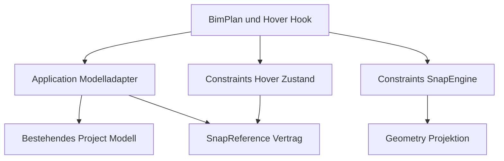
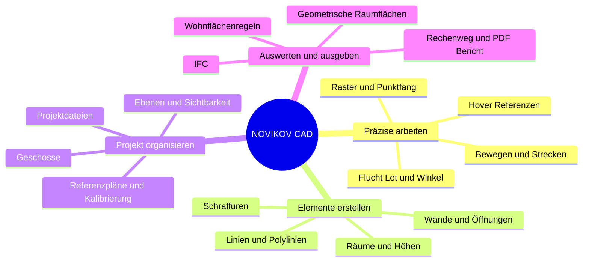
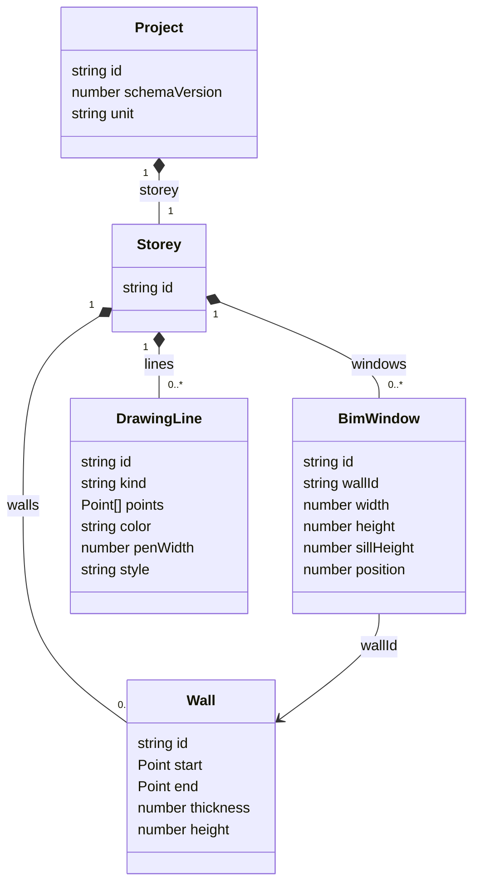

# NOVIKOV CAD Architekturprüfung und Funktionslandkarte

Prüfung vom 3. Oktober 2026

## Ergebnis

Die neue Raster-, Fang- und Hilfsliniengrundlage ist sinnvoll aufgebaut und eignet sich für schrittweise Verbesserungen. Die wichtigsten Verantwortlichkeiten sind getrennt: fachunabhängige Projektion, reine Fangberechnung, temporäre Hover-Verwaltung, Modelladapter und Darstellung.

Eine uneingeschränkte Bestätigung „die gesamte Architektur ist fertig und für große Projekte nachgewiesen skalierbar“ lässt sich daraus nicht ableiten. Der Bestand ist eine laufende Migration. Vor einer größeren Erweiterung der Engine sollten numerische Toleranzen, der zweite Fangweg bei Direct Edit und die wachsende Kandidatenlogik bearbeitet werden.

**Empfehlung:** Die vorhandene Engine behalten. Zuerst ihre gemeinsamen Grundlagen bereinigen, danach zusätzliche Fangarten und bessere Bedienung ergänzen. Kein Rewrite und kein vollständiger Ordnerumbau.

## Geprüfter Stand und Nachweise

- Repository: [novikov-architect-s-compass](https://github.com/russianboy23071995-rgb/novikov-architect-s-compass).
- Branch: `main`, Commit [`dd3e358e3856e4ab4224815b5d959252f9938b6b`](https://github.com/russianboy23071995-rgb/novikov-architect-s-compass/commit/dd3e358e3856e4ab4224815b5d959252f9938b6b), vom 3. Oktober 2026 um 02:28 Uhr deutscher Ortszeit.
- Bei der Abfrage waren keine offenen Pull Requests vorhanden. Nicht gepushte lokale Änderungen sind nicht Gegenstand der Prüfung.
- Gelesen wurden `ARCHITECTURE.md`, `AGENTS.md`, der Entwicklungsplan, Engine, Inference, Projektadapter, Geometrieprojektion, Direct-Edit-Controller, History, Modell, die relevante UI-Integration und Tests.
- Hier erneut ausgeführt: 13 unveränderte, isoliert ausführbare Testkörper aus der Engine-Testdatei und die fünf vorhandenen Kameratests. Alle 18 bestehen. Für die isolierte Ausführung wurden lediglich Imports und Auswahl der Testfälle in einer temporären Prüfdatei angepasst; Produktcode und Testkörper blieben unverändert.
- Vier modellabhängige Engine-Testfälle und die vollständige Suite wurden hier nicht erneut ausgeführt. Die benötigte Abhängigkeit `zod` ist in dieser Prüfungsumgebung nicht vorhanden. Build, vollständiges TypeScript/Lint und Browserprüfung wurden ebenfalls nicht erneut ausgeführt.
- Der Entwicklungsplan dokumentiert 135 bestandene Tests, TypeScript, Build und Browserprüfungen sowie sechs bekannte Lint-Warnungen. Das ist ein dokumentierter früherer Nachweis, kein hier erneut erzieltes Gesamtergebnis.

Die Prüfung ist eine gezielte Architektur- und Codeprüfung mit Teiltests. Sie ist keine Vollprüfung aller Produktfunktionen oder ein Lastnachweis.

## Was bereits gut getrennt ist

| Beobachtung | Konkreter Code | Bedeutung |
| --- | --- | --- |
| Fangberechnung ohne React und BIM-Imports | `src/constraints/snapping/engine.ts` | Werkzeuge können dieselbe Mathematik verwenden |
| Wiederverwendbare Projektion | `src/geometry/projections/direction.ts` | Geometry kennt Punkte und Richtungen, keine Wände |
| Referenzen aus dem bestehenden Modell | `src/application/snapping/project-references.ts` | Wandachsen, Ecken und Linienpunkte sind abgeleitet |
| Hover mit expliziter Zeitquelle | `src/constraints/inference/hover-reference.ts` | Aktivierung und Unterbrechung sind testbar |
| Temporäre Referenzen außerhalb des Projekts | `src/components/cad/useHoverReference.ts` | Hover erzeugt keine Bauteile oder Undo-Einträge |
| Gemeinsame Engine beim Zeichnen | `BimPlan.tsx`, Anbindung in `CadWorkspace.tsx` | Linie, Polylinie und Wandzeichnen teilen den Fangweg |
| Validierte Modelländerungen und History | `application/direct-edit/controller.ts`, `lib/bim/history.ts` | Bestätigte Änderungen laufen in dieselbe Snapshot-History |

Die Engine bietet derzeit Endpunkte, Raster, Achsführungen, Flucht, Lot, Diagonalen, Shift-Winkel und horizontale/vertikale Konstruktionen aus mehreren Hover-Referenzen. Der Kandidatentyp `intersection` bedeutet hier einen Schnittpunkt temporärer Achsführungen. Daraus folgt noch kein allgemeiner Schnittpunktfang zwischen Modellsegmenten. Mittelpunkte und beliebige Richtungsschnittpunkte sind noch nicht implementiert.

## Offene Punkte nach Priorität

### 1 Numerische Toleranzen ergänzen

**Befund:** Der Architekturvertrag verlangt eine zentrale Toleranzpolitik. In der neuen Fanglogik werden geometrische Kompatibilität und Referenzpositionen teilweise mit exaktem `===` beziehungsweise `!==` geprüft. Eine zentrale numerische Toleranz ist in diesen Modulen noch nicht vorhanden.

**Hier reproduziert:** Ein Endpunkt liegt bei `y = 0.3`. Die Ortho-Achse wird mit `y = 0.1 + 0.2` berechnet. JavaScript liefert dafür `0.30000000000000004`. Der Endpunkt liegt mathematisch auf derselben Achse, wird vom Endpunktfang jedoch abgewiesen. Ergebnis ist ein freier Ortho-Punkt mit `candidate = null`.

**Folge:** Bei berechneten, verschobenen oder importierten Punkten kann Fang unerwartet ausfallen.

**Korrektur:** Eine geometrische Toleranz in Modellmaßen definieren und getrennt vom Fangradius in CSS-Pixeln verwenden. Nahezu gleiche Koordinaten dürfen als geometrisch kompatibel gelten; deutlich abweichende Punkte dürfen dadurch nicht fälschlich als Endpunkt markiert werden. Für veraltete Referenzen stabile Feature-Identität und möglichst explizite Modellversion beziehungsweise gezielte Invalidierung verwenden. Nicht pauschal jeden Identitätsvergleich durch ein Epsilon ersetzen.

### 2 Direct Edit auf die gemeinsame Engine umstellen

**Befund:** Zeichnen läuft in `BimPlan.resolveDrawing` über `querySnap`. Direct Edit läuft in `BimPlan.editPoint` weiterhin über `drawingPoint` aus `components/cad/bim-view.ts`. Diese Funktion enthält ihre eigene Raster- und Ortho-Berechnung.

**Folge:** Eine neu gezeichnete Linie und eine verschobene Linie können unterschiedlich fangen. Verbesserungen der Engine kommen bei Direct Edit nicht automatisch an.

**Korrektur:** Direct Edit als weiteren Verbraucher anbinden. Dabei nicht nur denselben Funktionsaufruf einsetzen: Der Kontext muss das bearbeitete Element beziehungsweise ungeeignete eigene Griffe ausschließen, einen passenden Anker liefern und Vorschau/Bestätigung identisch auflösen. Ungültige Wand- und Fenstergeometrie bleibt durch die Modellvalidierung geschützt.

### 3 Kandidatenerzeugung und Auswahl entflechten

**Befund:** `querySnap` erzeugt Kandidaten, prüft Ortho, priorisiert Endpunkte, behandelt aktive Referenzen und berechnet Schnittpunkte. Bei mehreren Referenzen ruft die Funktion sich erneut auf und durchsucht dabei wieder die Referenzliste.

**Folge:** Für vier aktive Referenzen ist das derzeit begrenzt. Weitere Fangarten und beliebige Richtungsschnittpunkte machen die Funktion aber zunehmend schwerer zu prüfen und verursachen zusätzliche Scans.

**Korrektur:** Intern Kandidatenerzeuger, geometrische Kompatibilitätsprüfung und Rangfolge trennen. Eine einzelne Abfrage sammelt Kandidaten und entscheidet einmal. Den bestehenden öffentlichen Aufruf während der Umstellung möglichst erhalten. Keine leeren Plugin-Frameworks oder neuen Klassen auf Vorrat.

**Zusatzbefund:** Bei zwei gleichweit entfernten horizontalen Führungen mit demselben Feature-Namen entscheidet derzeit die Reihenfolge aktiver Referenzen. Der Effekt wurde mit zwei Referenzen bei `y=0` und `y=0.04` und Cursor `y=0.02` reproduziert. Das ist keine Zufallsberechnung, aber die gewünschte Regel muss ausdrücklich festgelegt werden: beispielsweise jüngste Referenz, stabile Quellen-ID oder Beibehaltung des vorherigen Kandidaten. Hysterese sollte die Entscheidung bei kleinen Mausbewegungen stabil halten.

### 4 Grenzen automatisch prüfen

**Befund:** Die gelesene ESLint-Konfiguration erzwingt die CAD-Schichtgrenzen noch nicht. Ihre Importbeschränkung betrifft nur `server-only`.

**Korrektur:** Eine kleine Architekturprüfung oder passende Lint-Regeln verhindern neue React-/DOM-/BIM-Imports in Geometry und neue UI-Abhängigkeiten in den fachlichen Modulen. Bestehende Übergangsbereiche ausdrücklich behandeln. Der aktuelle Code wird dadurch geschützt, ohne sofort alle Altdateien umzuziehen.

### 5 Workspace und Leistung schrittweise bearbeiten

`CadWorkspace.tsx` hat etwa 601 Zeilen, `BimPlan.tsx` etwa 617. Der Application-Reducer nimmt bereits einen Teil der Bearbeitungslogik auf; Auswahl und Zeichenabläufe sowie Dateiaktionen liegen weiterhin wesentlich in React-Komponenten. Das ist ein verbleibender Migrationsbereich, kein Anlass, das funktionierende System neu zu schreiben.

Mit weiteren Werkzeugen sollten gemeinsame Tool-Sitzungen und Auswahlzustände hinter Application-Grenzen wandern. Geometry und Domain müssen unabhängig von der UI bleiben. Räumlicher Index, Caches und effizientere History folgen gemessenen Problemen. Die lineare Suche und wiederholten Scans sind für große Modelle noch nicht durch Lasttests abgesichert.

## Aktuelle Abhängigkeiten der Fangfunktion

Die Pfeile bedeuten „verwendet beziehungsweise importiert“. Sie zeigen keinen Datenbesitz. Das Projekt wird der Ansicht und dem Adapter als Eingabe übergeben.



Das Modell importiert die Engine nicht. Die Engine benötigt keine Wanddefinition. `SnapReference` ist derzeit ein TypeScript-Typ in der Engine-Datei; die Trennung in eine eigene Vertragsdatei ist erst bei konkretem Nutzen nötig.

## Ausgangspunkt für unsere gemeinsame Funktionsmindmap

Diese Mindmap ordnet vorhandene und geplante Funktionen. Sie behauptet nicht, dass alle Zweige schon implementiert sind. Details und Status stehen in der anschließenden Tabelle.



UI, Maus, Tastatur, Text und Sprache sind Zugänge zu diesen Funktionen. Sie sollen keine eigenen Versionen des Bauteilmodells oder der Berechnung besitzen.

## Typdiagramm des heutigen fachlichen Modells

Der aktuelle Code verwendet TypeScript-Typen und Funktionen, keine entsprechende Sammlung objektorientierter Klassen. Das folgende Klassendiagramm beschreibt deshalb Datenbeziehungen und ist keine Aufforderung, alles in Klassen umzuschreiben.



Mehrere Geschosse, Räume, Ebenen und Referenzzeichnungen sind Zielerweiterungen. Sie werden nicht im Diagramm als bestehender Code dargestellt. Insbesondere hat das derzeitige `Project` genau ein `storey`-Feld; mehrere Geschosse erfordern eine bewusste Dateimigration.

## Zuordnung der Wünsche zu Zuständigkeiten

| Wunsch | Fachliche Zuständigkeit | Zugang und Darstellung | Stand beziehungsweise Voraussetzung |
| --- | --- | --- | --- |
| Endpunkte, Raster, Hover, Flucht, Lot, Shift-Winkel | Geometry und Constraints | Gemeinsamer Tool-Kontext; Marker in Rendering/UI | Vorhanden, mit den genannten Grenzen |
| Mittelpunkt und Segment-Schnittpunkte | Geometry und Constraints | Derselbe Fangzugang | Geplant; temporärer Achsschnittpunkt ist kein Ersatz |
| Gemeinsames Bewegen, Punktbearbeitung, Strecken | Application-Aktionen und Domain-Validierung | Auswahlmenü, Griffe, Inspector | Direct-Edit-Controller vorhanden; Fang vereinheitlichen |
| Auswahlkontext und bewegliches Menü | Application Selection; Menüposition in UI | DemandMenu und Eigenschaftenleiste | Auswahl noch wesentlich im Workspace |
| Linie und Polylinie mit Darstellungsattributen | Domain DrawingLine | LineTool und 2D-Renderer | Vorhandene Typen wiederverwenden |
| Schraffur mit Kontur, Muster und Deckkraft | Domain Hatch; Polygongeometrie | 2D-Werkzeug und Renderer | Geplant |
| Ebenen, Standardzuordnung und Sichtbarkeit | Domain Layer; Sichtbarkeit im View-Kontext | Organisation und Ebenenumschalter | Geplant; Fangfilter benötigt dieselbe Sichtbarkeitsregel |
| Maßstableiste | Rendering Viewport | Anzeige unter Canvas | Bildschirmmaßstab vorhanden; Ausgabe separat definieren |
| PDF-/Bildreferenz und Kalibrierung | Domain ReferenceDrawing; Application CalibrateReference; Interop Import | Zwei Messpunkte und Längeneingabe | Geplant; Assets müssen Dateirundlauf überstehen |
| Raumkennung, Name und geometrische Fläche | Domain Room; Geometry Polygon; Application Raumablauf | Raumwerkzeug und Inspector | Geplant; geschlossene und virtuelle Grenzen definieren |
| Lichte Höhen und Höhenbereiche | Domain Bezug auf Quellen; gemeinsamer Geometry-Auswertungsdienst | Raumeigenschaften und Höhenlinien | Geplant; benötigt geeignete Dach-/Deckenquellen oder ausdrückliche manuelle Quellen |
| Wohnfläche und Abzüge | Fachlicher Berechnungsdienst mit versionierten Regeln | Nachvollziehbare Ergebnisse in UI | Geplant; Regelgrundlage vor Umsetzung amtlich prüfen |
| Bericht mit Name, Adresse, Räumen und Rechenweg | Berichtsdaten aus Berechnung; Interop PDF | Vorlagenwahl und Export | Geplant; PDF berechnet keine eigene Fläche |
| AI und Sprache | AI-Adapter auf Application-Aktionen | Text-/Sprachoberfläche | Bestehende Commands erweitern; keine direkte Modellmutation |
| Speichern, Laden und IFC | Interop-Adapter auf gemeinsames Modell | Dateiaktionen | Bestand unter `lib/bim`; schrittweise entflechten |

Die Zuordnung des künftigen Wohnflächen- und Berichtsdiensts wird bei seiner Umsetzung im Architekturvertrag konkretisiert. Fachliche Berechnungsregeln bleiben unabhängig von der PDF-Ausgabe und von React.

## So wachsen Mindmap und Architektur zusammen

Für jeden neuen Wunsch ergänzen wir einen Eintrag mit sechs Informationen:

1. **Benutzerablauf:** Was möchtest du konkret machen? Beispielsweise eine Polygonkante parallel verschieben.
2. **Daten:** Welche bestehende oder neue Information muss gespeichert werden?
3. **Aktion:** Welche gemeinsame Application-Operation bestätigt die Änderung?
4. **Abhängigkeiten:** Welche Geometrie, Fangfunktion oder Modellbeziehung wird gebraucht?
5. **Konsistenz:** Was muss sich bei Undo, Speichern/Laden, 2D/3D und Export mitändern?
6. **Abnahme:** Welches konkrete Beispiel beweist, dass es richtig funktioniert?

Du kannst neue Funktionen in Alltagssprache beschreiben. Daraus entsteht zuerst ein Eintrag in der Funktionslandkarte, dann eine fachliche Spezifikation und anschließend ein kleiner implementierbarer Auftrag. Ein Diagramm allein schafft keine Skalierbarkeit; klare Verträge, konsistente Modelländerungen, Tests und Messungen müssen diese Struktur im Code absichern.

## Nächster Codex Auftrag

Dieser Auftrag verändert zunächst die Fanggrundlage. Neue Fangarten und zusätzliche BIM-Elemente bleiben Folgeaufträge.

```text
Prüfe den aktuellen Arbeitsstand von NOVIKOV CAD gegen ARCHITECTURE.md,
AGENTS.md, DEVELOPMENT_GUIDE.md und DEVELOPMENT_PLAN.md. Verwende den aktuellen
Branch und bewahre bestehende Änderungen. Der Architekturreview vom 03.10.2026
bezog sich auf main dd3e358; gleiche seitdem geänderten Code zuerst ab.

Setze als ersten begrenzten Auftrag eine zentrale numerische Toleranzpolitik
für die gemeinsame Fang-/Geometriegrundlage um. Trenne Modell-Toleranz von
Bildschirm-Fangradius. Reproduziere vorab den Fehler: Endpoint y=0.3 wird bei
Ortho-Origin y=0.1+0.2 abgewiesen. Sichere die Korrektur durch einen Regressionstest.
Prüfe auch echte abweichende Punkte, große Koordinaten und verschiedene Zoomstufen.
Behalte exakte Modellkoordinaten und eindeutige Fangkennzeichnung bei.

Prüfe Identitäts- und Invalidierungsvergleiche gesondert; ersetze nicht alle
Vergleiche pauschal durch Epsilon. Stelle bestehende Fangprioritäten, Shift,
Hover, mehrere Referenzen und Undo/Redo nicht um, soweit die Korrektur es nicht
erfordert. Führe die vollständigen vorhandenen Tests und passenden Prüfungen aus.

Dokumentiere im Entwicklungsplan anschließend diese getrennten Folgeaufträge:
1. Direct Edit an denselben Fangweg mit geeignetem Ausschluss eigener Quellen
   anbinden; Vorschau und Klick müssen denselben Punkt liefern.
2. Kandidatenerzeugung und Rangfolge ohne rekursive Gesamtabfragen trennen;
   bei Gleichstand Quellen-/Aktivierungsregeln ausdrücklich festlegen.
3. Allgemeine Richtungsschnittpunkte und Hysterese ergänzen.
4. Architekturgrenzen automatisiert absichern und große Modelle messen.

Keine Neuschreibung, kein allgemeines Plugin-Framework und kein Komplettumbau
der Ordnerstruktur. Berichte das tatsächliche Ergebnis, Grenzen, einen kurzen
Bedienversuch und den nächsten konkreten Auftrag.
```

## Quellen im geprüften Commit

- [Architekturvertrag](https://github.com/russianboy23071995-rgb/novikov-architect-s-compass/blob/dd3e358e3856e4ab4224815b5d959252f9938b6b/ARCHITECTURE.md)
- [Entwicklungsplan und bisherige Nachweise](https://github.com/russianboy23071995-rgb/novikov-architect-s-compass/blob/dd3e358e3856e4ab4224815b5d959252f9938b6b/DEVELOPMENT_PLAN.md)
- [SnapEngine](https://github.com/russianboy23071995-rgb/novikov-architect-s-compass/blob/dd3e358e3856e4ab4224815b5d959252f9938b6b/src/constraints/snapping/engine.ts)
- [Modelladapter](https://github.com/russianboy23071995-rgb/novikov-architect-s-compass/blob/dd3e358e3856e4ab4224815b5d959252f9938b6b/src/application/snapping/project-references.ts)
- [Hover-Verwaltung](https://github.com/russianboy23071995-rgb/novikov-architect-s-compass/blob/dd3e358e3856e4ab4224815b5d959252f9938b6b/src/constraints/inference/hover-reference.ts)
- [Integration in Grundriss und Bearbeitung](https://github.com/russianboy23071995-rgb/novikov-architect-s-compass/blob/dd3e358e3856e4ab4224815b5d959252f9938b6b/src/components/cad/BimPlan.tsx)
- [Bestehendes Modell](https://github.com/russianboy23071995-rgb/novikov-architect-s-compass/blob/dd3e358e3856e4ab4224815b5d959252f9938b6b/src/lib/bim/model.ts)
- [Lint-Konfiguration](https://github.com/russianboy23071995-rgb/novikov-architect-s-compass/blob/dd3e358e3856e4ab4224815b5d959252f9938b6b/eslint.config.js)
