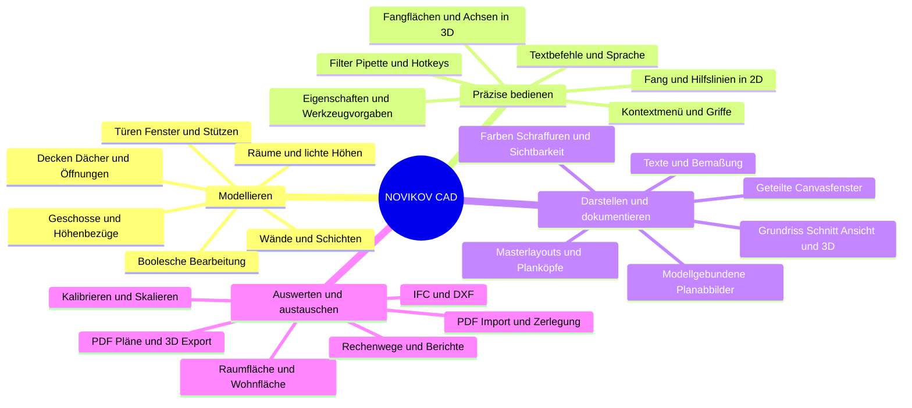
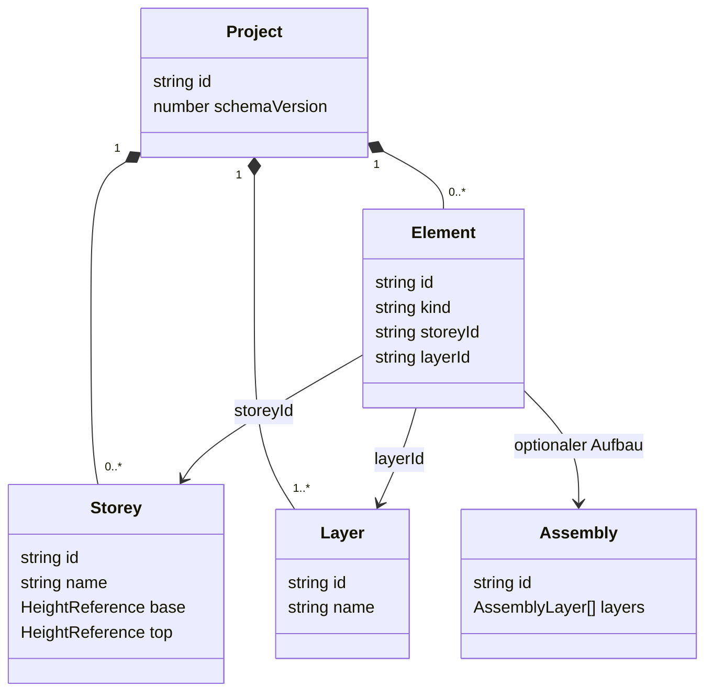
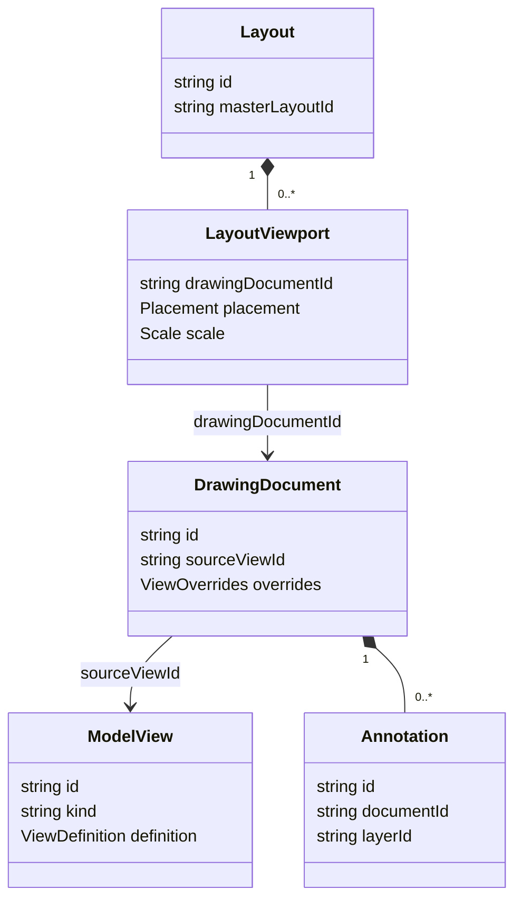
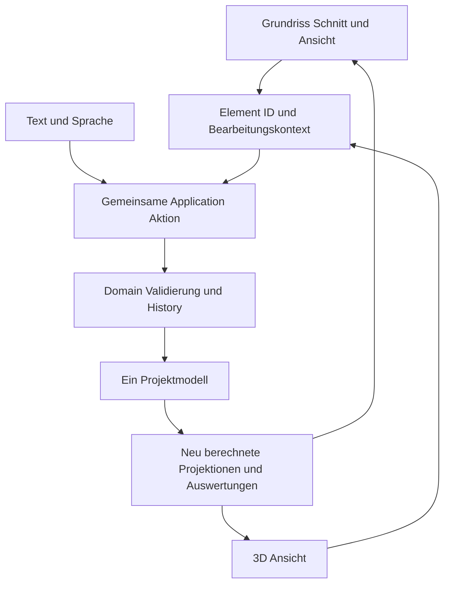

# NOVIKOV CAD Funktionsarchitektur und Entwicklungsplan

Grundlage: fünfseitige Nutzerdatei FUNKTIONEN 03.10.2026.pdf. Erstfassung vom 3. Oktober 2026.

## Zweck und Verbindlichkeit

Dieses Dokument ordnet deine erweiterte Funktionsliste in eine gemeinsame Architektur ein. Es enthält eine Funktionsmindmap, vorgeschlagene Datenbeziehungen, eine Anforderungsmatrix und eine Reihenfolge für begrenzte Codex-Aufträge.

Die Produktwünsche stammen aus der PDF. Die technischen Typnamen, Verantwortlichkeiten und Umsetzungsschritte sind Vorschläge. Sie sind noch keine implementierten Module. Als letzter hier geprüfter Repository-Stand gilt `main` mit Commit `dd3e358` vom 3. Oktober 2026; seitdem erfolgte Änderungen wurden für diese Zuordnung nicht erneut geprüft.

Der bestehende Architekturvertrag bleibt maßgeblich. Die neue PDF ergänzt und präzisiert den bisherigen Guide. Nicht erneut genannte Wünsche, beispielsweise Linienattribute aus dem früheren Guide, werden nicht stillschweigend gestrichen. Bei tatsächlichen Konflikten wird die Entscheidung dokumentiert. Die Kennungen N01–N60 gehören ausschließlich zu dieser neuen Matrix; sie ersetzen keine historischen F-Kennungen.

## 1 Die entscheidenden Architekturregeln

### Ein Modell für alle Bearbeitungsansichten

Grundriss, Schnitt, Ansicht und 3D zeigen dieselben Bauteile. Eine Änderung an einer Wand wird über eine gemeinsame Application-Aktion auf deren stabile ID angewendet. Die Darstellung im Schnitt besitzt keine eigene bearbeitbare Kopie dieser Wand.

Ein Rendering-Treffer muss auf das Ursprungselement und gegebenenfalls ein zulässiges Feature zurückgeführt werden. Nicht jede sichtbare Schnittkante ist ein frei verschiebbarer Wandpunkt. Unterstützte Aktionen werden vom Elementtyp und Ansichtskontext bestimmt.

### Planabbilder sind gespeicherte Ableitungen

Ein Abbild erhält einen Verweis auf seine Quellansicht sowie eigenen Ausschnitt, Ausgabemaßstab, Ebenensichtbarkeit und Darstellungsregeln. Es aktualisiert seine Modellprojektion bei Modelländerungen. Eigene Texte, Schraffuren und andere Ergänzungen liegen in einer getrennten Dokumentebene und haben einen ausdrücklichen Geltungsbereich.

„Alle Zeichnungen werden vom Modell abgeleitet“ wird für die Bauteildarstellung umgesetzt. Deine ebenfalls gewünschten Texte und 2D-Gestaltungen können unabhängig davon hinzukommen. Diese Ergänzungen sind gespeichert, aber keine zweite BIM-Geometrie. Modellbearbeitung und Dokumentergänzung brauchen einen erkennbaren Modus.

### Modelländerung Ansichtszustand und Dokumentinhalt unterscheiden

| Art der Information | Beispiel | Speicherung und History |
| --- | --- | --- |
| Modell | Wandhöhe, Fensterposition, Geschossbezug | Projektdatei; validierte Modellaktion mit Undo |
| Gespeicherte Darstellung | Ausschnitt, Ebenenfilter eines Abbilds, Plankopf | Dokument-/Ansichtsdefinition im Projekt; passende Dokumentaktion |
| Dokumentergänzung | Text oder Schraffur nur in einem Planabbild | Referenz auf Dokument und Ebene; Dokumentaktion mit Undo |
| Flüchtige Bedienung | Maus-Hover, offene Menüs, temporäre Fangflächen | Kein BIM-Datensatz und kein Undo pro Mausbewegung |
| Persönliche Präferenz | Letzte Menüaktion, Werkzeugvoreinstellungen | Einstellungen, soweit gewünscht; keine fachliche Modelländerung |

Modell und gespeicherte Dokumente können zunächst in derselben versionierten Projektdatei und Snapshot-History liegen. Getrennte Verantwortlichkeiten verlangen nicht sofort getrennte Datenbanken oder eigene History-Systeme.

### Organisationsebenen sind keine Materialschichten

`Layer` bedeutet eine Organisationsebene wie Decke, Bemaßung oder Textelemente. `AssemblyLayer` bedeutet eine Bauteilschicht wie Putz, Mauerwerk oder Dämmung. Ein mehrschichtiges Bauteil besitzt einen Schichtenaufbau und zugleich eine Organisationsebene. Darstellungsüberschreibungen verändern keinen Materialaufbau.

### Höhenbezüge ausdrücklich speichern

Ein Bauteil kann eine feste Höhe besitzen oder seine Höhe aus Geschossbezügen ableiten. Dafür benötigt es einen ausdrücklichen Modus sowie obere und untere Bezüge mit gegebenenfalls Offsets. Eine Änderung der Geschosshöhe darf nur die daran gebundenen Bauteile verändern. Ungültige Fenster- oder Öffnungsbeziehungen werden vor Bestätigung behandelt.

### AI und Sprache von Anfang an an denselben Aktionen beteiligen

AI ist dein wichtigster Bedienzugang. Deshalb erhält jede neue geprüfte Modellaktion früh einen expliziten, typisierten Vertrag. Text und Sprache verwenden denselben Vertrag wie Maus und Eigenschaftenleiste. Mehrdeutige Ziele werden geklärt, und Vorschauen dürfen bei veraltetem Kontext nicht angewendet werden. Die AI bekommt keinen eigenen Geometriekern.

## 2 Funktionsmindmap

Die Mindmap beschreibt den gewünschten Produktumfang, nicht den Fertigstellungsstand.



## 3 Vorgeschlagene Datenbeziehungen

Die folgenden Typen sind ein Zielmodell. Funktionsbasierter TypeScript-Code bleibt zulässig; die Diagramme verlangen keine Umstellung auf objektorientierte Klassen.

### Gebäudestruktur



`Element` ist hier der gemeinsame Begriff für konkrete Typen wie Wall, Slab oder DrawingLine. Nicht jeder Typ benötigt alle Bezüge; planbezogene Texte brauchen beispielsweise keinen Geschossbezug. Discriminated Unions können solche Unterschiede präziser ausdrücken als eine große Klasse mit vielen optionalen Feldern. Eine separate Building-Identität wird ergänzt, wenn mehrere Gebäude oder eigene Gebäudeeigenschaften gebraucht werden.

### Ansichten Planabbilder und Papierlayouts



ModelView definiert einen Grundriss, Schnitt, eine Ansicht oder 3D-Sicht. DrawingDocument ist dein aktualisierbares Abbild. LayoutViewport platziert dieses Abbild auf dem Papier. MasterLayout liefert Format und Plankopf. Ein sichtbares Canvasfenster verweist auf eine dieser Ansichten beziehungsweise Dokumente; es besitzt deren Inhalte nicht.

### Gemeinsame Modellbearbeitung aus verschiedenen Ansichten



Die Pfeile zeigen hier den Ablauf einer Änderung, keine Importregeln. Dokumentaktionen für Layouts oder Anmerkungen folgen einem entsprechenden kontrollierten Pfad.

## 4 Vollständige Anforderungsmatrix aus der PDF

Seitenzahlen beziehen sich auf die beigefügte PDF. „Offen“ bezeichnet eine fachliche Entscheidung, keine Aufforderung, den gesamten Fortschritt anzuhalten. Die Zuständigkeiten sind Zielzuordnungen; Codex muss sie mit dem aktuellen Code abgleichen.

| ID | Anforderung | Seite | Zuständigkeit oder Voraussetzung |
| --- | --- | --- | --- |
| N01 | Gemeinsames BIM-Modell für komplexe geometrische Entwürfe | 1 | Domain und Geometry; ein Modellzustand |
| N02 | PDF-Pläne, 3D-Modelle, IFC und DXF exportieren | 1 | Interop; 3D-Format und DXF-Umfang noch festlegen |
| N03 | Darstellung von 2D/3D ändern, Farbe oder Schraffur | 1 | Render-Stile und ViewOverrides |
| N04 | Maßstab von Canvas, Grundriss, Schnitt und Ansicht | 1 | Viewport-Zoom und Ausgabemaßstab getrennt |
| N05 | Schnitt- und Ansichtswerkzeuge erzeugen 2D-Ableitungen | 1 | ModelView und Geometry-Projektion |
| N06 | Abgeleitete 2D-Dokumente bearbeiten | 1 | Modellaktion oder Dokumentergänzung ausdrücklich unterscheiden |
| N07 | Fang in 3D und Hilfsflächen für X/Y/Z | 1 | Arbeitsebene, Strahlabfrage, Point3 und Constraints |
| N08 | Hochwertige Raster und Hilfslinien auf Bedarf | 1 | Gemeinsame Constraints-Engine |
| N09 | Bewegliches On-Demand-Menü bei Elementauswahl | 1 | UI auf gemeinsamem Selection-Kontext |
| N10 | Gesamtes Element bewegen | 1 | Application MoveElement |
| N11 | Punkt einfügen oder vorhandenen Punkt verschieben | 1 | Application mit typabhängiger Topologieprüfung |
| N12 | Linie knicken oder Polygon um weiteren Eckpunkt erweitern | 1 | Polyline-/Polygonaktionen; kein beliebiger BIM-Punkt |
| N13 | Ganze Polygonkante versetzen und Fläche verbreitern | 1 | OffsetEdge; gültiges Ergebnis prüfen; nicht für einfache Linien |
| N14 | Letzte Menüaktion bei kompatibler Geometrie vormerken | 1 | Persönliche Präferenz plus Capability-Prüfung |
| N15 | Maßstab in unterer Leiste ändern | 1 | UI für Ansichts- und Ausgabemaßstab |
| N16 | Alle Elementtypen einer Organisationsebene zuordnen | 1 | Domain Layer; auch Texte, Kreise und Möbel berücksichtigen |
| N17 | Ebenen einzeln, alle oder als Ausnahmeauswahl schalten | 2 | ViewVisibility; Isolate/HideExcept/ShowAll/HideAll |
| N18 | AI und Sprache als zentraler Bedienzugang | 2 | Adapter auf geprüfte Application-Aktionen |
| N19 | Wände, Türen, Fenster, Decken, Dächer per Sprache/Text | 2 | Typisierte Erstellungsaktionen und Zielkontext |
| N20 | Bemaßung per Sprache/Text | 2 | Dimension-Aktionen; konkrete Intents später definieren |
| N21 | Geschosse im Navigator frei erstellen und Höhen definieren | 2 | Domain Storey; bestehendes Ein-Geschoss-Format migrieren |
| N22 | Wände, Stützen und andere Bauteile kennen Geschosshöhen | 2 | HeightBinding statt kopierter Höhe ohne Bezug |
| N23 | Deutsch als erste Programmsprache | 2 | Einheitliche UI-Texte und Eingabeinterpretation |
| N24 | Modelllängen in Metern | 2 | Gemeinsame Units-Konvention; Dezimalkomma unterstützen |
| N25 | Ausschließlich 2D-Elemente und importierte PDF-Dateien proportional per Messlinie skalieren | 2 | Scale2DSelection/CalibratePdf; 3D- und BIM-Bauteile ausgeschlossen, auch im Grundriss |
| N26 | Boolesche Operationen für komplexe 3D-Modelle | 2 | Fachunabhängiger Solid-Kern und Domain-Features |
| N27 | Wände schneiden und aussparen | 2 | Gehostete CutFeature; validierbare Abhängigkeiten |
| N28 | Hochgeladene PDFs in 2D-Elemente zerlegen | 2 | Interop-Import; Vektor und Raster unterscheiden |
| N29 | Modell im Grundriss, Schnitt, Ansicht und 3D bearbeiten | 2 | Gemeinsame ID-basierte Aktionen und View-Kontext |
| N30 | Wände/Fenster verschieben und Elemente löschen | 2 | Gemeinsame Transform-/Delete-Aktionen |
| N31 | Räume in geschlossenen oder teiloffenen Wandbereichen | 2 | RoomBoundary; explizite virtuelle Grenzen |
| N32 | Raumname, Kennung ab R-001 und Fläche | 2 | Room; interne ID getrennt von sichtbarer Kennung |
| N33 | Lichte Raumhöhen und konfigurierbare Höhenlinien | 2 | HeightField aus unteren/oberen Bezugsflächen |
| N34 | Messbezug Fußbodenoberkante und Dachunterkante | 2 | Persistente Referenzen auf Höhenquellen |
| N35 | Wohnfläche mit Nischen, Schornstein- und Vorwandabzügen | 3 | Versionierter Regelservice; amtliche Regeln vor Umsetzung prüfen |
| N36 | Berichtsvorlage und PDF mit nachvollziehbarem Rechenweg | 3 | Berichtsdaten aus Berechnung; Interop PDF |
| N37 | Geschossanzahl, Raumzahl, Name und Adresse im Bericht | 3 | Metadaten und Berichtsumfang |
| N38 | Räume standardmäßig auf Ebene Raum | 3 | Layer-Standardzuordnung |
| N39 | Rechtecke/Polygone für Gestaltung und Schraffur | 3 | DrawingPolygon/Hatch; Ebene 2D-Ergänzungen |
| N40 | Optionale Farbe/Kontur, Deckkraft, Muster wie Mauerwerk | 3 | Appearance und Renderer |
| N41 | Wanddicke und geschossabhängige oder alternative Höhe | 3 | Wall-Parameter und HeightBinding |
| N42 | Monolithische oder mehrschichtige Wand, eigene Schichten | 3 | Assembly und Materialdefinitionen |
| N43 | Einzelwand oder fortlaufende Wände mit Doppelklickabschluss | 3 | Tool-Sitzung; gewünschte Undo-Gruppierung festlegen |
| N44 | Saubere Wandanschlüsse an Ecken und T-Verbindungen | 3 | Domain Join-Regeln und daraus abgeleitete Geometrie |
| N45 | Verschiebbare Hauptachse im Wandaufbau | 3 | Referenzlinie und Offset; Verhalten beim Umstellen festlegen |
| N46 | Wände, Fenster und andere Elemente bemaßen, Maßketten | 3 | Assoziative Dimension-Referenzen; Ebene Bemaßung |
| N47 | Decken mit Schichten, Material, Darstellung, Höhe/Stärke | 3 | Slab und Assembly; Ebene Decke |
| N48 | Deckendurchbrüche einfügen | 3 | Gehostete Öffnung; Profile und Modellvalidierung |
| N49 | Text mit Hochstellung, Farbe, Größe, Schrift und Hervorhebung | 3 | TextAnnotation und TextStyle; Ebene Textelemente |
| N50 | Text mit farbiger Umrandung und Hintergrund | 3 | TextStyle; Dokument-/Modellscope festlegen |
| N51 | Elemente nach Typ oder Eigenschaften filtern | 4 | Application Query/Selection; gemeinsame Sichtbarkeitsregeln |
| N52 | Pipette für Farbauswahl im Filter | 4 | UI-Eingabeadapter; fachliche/angezeigte Farbe unterscheiden |
| N53 | Eine Eigenschaftenleiste für Werkzeugvorgaben und Auswahl | 4 | Schema-/Capability-basierter UI-Adapter |
| N54 | E bewegen, Strg+E kopieren/bewegen, D drehen, Strg+D drehen | 4 | Shortcut-Router; Unterschied D/Strg+D offen |
| N55 | Rotation mit Kreis als Fang-/Bedienhilfe | 4 | RotateSession und Constraints; Overlay im Renderer |
| N56 | Navigator für Geschosse, Schnitte, Ansichten und 3D | 4 | Referenzen auf ModelView und Gebäudestruktur |
| N57 | Aktualisierbare Abbilder mit eigener Ebenendarstellung | 4–5 | DrawingDocument; keine Bauteilkopie |
| N58 | Ausschnitte und zusätzliche Gestaltung/Text in Abbildern | 4–5 | ViewOverrides und dokumentbezogene Annotationen |
| N59 | Abbilder in Master-/Exportlayouts mit A4/A3/A2 und Plankopf | 5 | Layout, MasterLayout und LayoutViewport; eigener Navigatorbereich |
| N60 | Bildschirm teilen, Fenster aktivieren und Inhalt zuweisen | 5 | ViewportBinding; ausgewähltes Dokument und Kamera je Fenster |

## 5 Präzisierungen für eine stabile Umsetzung

### 3D-Fang ist mehr als ein weiterer Mauspunkt

In 2D entspricht der Cursor einem Punkt der Arbeitsebene. In 3D entsteht zunächst ein Strahl aus Kamera und Cursor. Arbeitsebene, Bauteilfläche oder Achsconstraint bestimmen daraus den Bearbeitungspunkt. Fangabstände bleiben bildschirmbezogen. Die erste 3D-Etappe sollte genau eine definierte Arbeitsebene, Achsführung und vorhandene Bauteilendpunkte unterstützen. Hilfsflächen sind temporär, solange der Benutzer sie nicht ausdrücklich als Arbeitsreferenz speichert.

### Punktbearbeitung muss den Elementtyp respektieren

Eine Linie mit eingefügtem Punkt wird fachlich zur Polylinie. Bei einem Polygon kann ein zusätzlicher Vertex die Kontur verändern. Eine gerade BIM-Wand darf nicht ohne festgelegte Regel in eine beliebig geknickte Wand verwandelt werden. Dafür sind beispielsweise mehrere verbundene Wände oder ein eigener Wandpfadtyp erforderlich. Das Menü zeigt nur unterstützte Aktionen. Eine vorgemerkte Aktion aktiviert einen Bearbeitungsmodus, führt aber nicht beim Öffnen bereits eine Modelländerung aus.

### Wandachse und Schichtenaufbau gemeinsam definieren

Die Hauptachse braucht eine klare Referenz: Außenkante, Innenkante, Mitte oder definierter Schichtbezug. Vor der Umsetzung ist festzulegen, ob beim Wechsel der Achse die physische Wandlage bleibt oder die Wand relativ zur unveränderten Zeichenachse wandert. Die Gesamtstärke kann aus Schichten abgeleitet sein; widersprüchliche unabhängige Werte werden vermieden.

### PDF-Zerlegung und Bildinterpretation getrennt behandeln

Ein Vektor-PDF kann Pfade, Text und Transformationsinformationen liefern, soweit der Importer diese unterstützt. Ein eingescanntes PDF enthält zunächst ein Bild. Dessen Umwandlung benötigt zusätzliche Erkennung und kann unvollständig sein. Zerlegen bedeutet zunächst 2D-Elemente; daraus entstehen nicht automatisch Wände oder andere BIM-Bauteile. Gruppierung, Einheiten, Kalibrierung und Importbericht bleiben nachvollziehbar.

### Skalieren ausschließlich für 2D Elemente und importierte PDFs

Verbindliche Nutzerpräzisierung vom 3. Oktober 2026: Skalieren wird ausschließlich für echte 2D-Elemente und importierte PDF-Dateien angeboten. 3D-Elemente und BIM-Bauteile wie Wände, Fenster, Türen, Decken oder Dächer werden nie skaliert. Das gilt auch dann, wenn sie gerade im Grundriss, Schnitt oder in einer Ansicht dargestellt werden. Die Ansicht macht aus einem BIM-Bauteil kein 2D-Element.

Die Application-Aktion prüft die Skalierfähigkeit anhand des Elementtyps und weist unzulässige Ziele ab; eine reine UI-Sperre reicht nicht. Bei gemischter Auswahl wird die gesamte Skalieraktion mit verständlichem Hinweis abgewiesen, statt nur einen Teil unbemerkt zu ändern. Maus, Text und Sprache verwenden dieselbe Prüfung. Für zulässige 2D-Elemente und PDF-Referenzen werden Anker, Messstrecke, Ziellänge, Vorschau und Undo definiert. Bei 2D-Texten und Darstellungsattributen werden die Details vor der jeweiligen Umsetzung festgelegt. Fachliche Parameteränderungen an BIM-Bauteilen bleiben normale Bearbeitungsaktionen.

### Boolesche Bearbeitung nachvollziehbar speichern

Als Startvorschlag werden Schnitt-/Aussparungsoperationen mit stabilen IDs, Zielbezug und Parametern gespeichert; der resultierende Körper wird daraus abgeleitet. Ein generierter Mesh ist keine neue authoritative Wand. Änderungen des Hosts, fehlgeschlagene Schnitte, Undo und IFC müssen definiert sein. Die Wahl einer geeigneten Geometry-Bibliothek erfolgt erst nach einem kleinen geprüften Machbarkeitsfall mit offiziellen technischen Quellen.

### Maßstab und Einheiten nicht vermischen

Das Modell arbeitet in Metern. Bildschirmzoom bleibt eine Ansichtsoperation. Ein Druckmaßstab wie 1:100 bestimmt die Größe auf dem Papier. Papierformat und typografische Größen sind Darstellungsangaben und verändern die Modellmaße nicht. Die UI muss anzeigen, welcher Wert gerade geändert wird.

### Anmerkungen Bemaßung und Farben eindeutig zuordnen

Bemaßungen sollten soweit möglich stabile Modellfeatures referenzieren und sich nach Änderungen neu berechnen. Nicht mehr gültige Referenzen werden sichtbar gemeldet. Für Text und Schraffur ist ihr Scope zu speichern: geschossbezogene Ergänzung oder nur ein bestimmtes Abbild. Die Pipette muss wissen, ob sie eine gespeicherte Farbe oder eine durch Ansichtsregeln überschrieben dargestellte Farbe übernimmt.

### Hotkeys benötigen eine einzige Zuständigkeit

Die PDF nennt für D und Strg+D jeweils Drehen. Strg+D wird daher zunächst als ungeklärte Variante behandelt, nicht eigenmächtig als Kopieren+Drehen umgesetzt. Browserbefehle und Texteingabefelder müssen berücksichtigt werden. Nur das aktive Canvasfenster erhält Zeicheneingaben; globale Modellaktionen verwenden trotzdem den gemeinsamen Auswahlkontext.

## 6 Empfohlene Entwicklungsreihenfolge

AI-Verträge, Validierung, Undo und Dateirundlauf werden in jeder Modell-Etappe mitbearbeitet. Sie sind keine späte Zusatzphase. Die genaue Reihenfolge innerhalb einer Etappe richtet sich nach dem verifizierten Codebestand.

| Paket | Ergebnis | Kleine erste Umsetzung |
| --- | --- | --- |
| A | Anforderungen und Architekturergänzungen dokumentiert | N01–N60 dem aktuellen Code und den bisherigen F-Kennungen zuordnen |
| B | Gemeinsame präzise Bearbeitung | Toleranzfehler korrigieren, dann Direct Edit an gemeinsame Fang-API anschließen |
| C | Werkzeugvorgaben, Auswahl und Organisation | Einheitlicher Eigenschaftenkontext, Layer-Zuordnung, Sichtbarkeitsfilter |
| D | Gebäude und parametrisierte Bauteile | Mehrere Geschosse mit Dateimigration; ein an Geschosshöhe gebundener Wandfall |
| E | Wandaufbau und Anschlüsse | Erst Achsenregel, dann Schichten und geprüfter Eck-/T-Anschluss |
| F | Erweiterte Elemente und 2D-Ergänzungen | Decke mit Öffnung; danach Türen/Dächer und einzelne Annotationstypen |
| G | Gemeinsame Ansichts- und Dokumentstruktur | ModelView/DrawingDocument minimal; ein live aktualisierter Grundriss mit eigenem Ebenenfilter |
| H | Schnitte und Ansichten mit Bearbeitungskontext | Ein Schnitt gerader Wände/Decken; Treffer auf vorhandene Modell-IDs abbilden |
| I | Arbeit in 3D | Ein Move-Vorgang auf expliziter Arbeitsebene mit derselben Aktion wie in 2D |
| J | Räume, Höhen und Auswertungen | Raumfläche, dann geprüfte Höhenquellen und Wohnflächenregeln |
| K | Layouts und Export | Ein Abbild im A4-Masterlayout mit Plankopf und PDF-Ausgabe |
| L | Import und komplexe Geometrie | Vektor-PDF-Machbarkeitsfall und separat eine validierte Wandaussparung |

Importkalibrierung, Texte und einfache Ebenen können bei Bedarf früher entstehen. Vollständige PDF-Zerlegung und frei kombinierbare Boolesche Operationen bekommen eigene Machbarkeits- und Testaufträge. Ein räumlicher Index oder eine neue History-Technik folgt gemessenen Engpässen.

Die Datenverträge für ModelView, DrawingDocument und ViewportBinding werden vor weiteren Layout-Sonderlösungen festgehalten. Die komplette Schnitt- oder Druckberechnung muss dafür noch nicht implementiert werden.

## 7 Abnahmeregel für jeden Teilauftrag

- Ein konkreter Benutzerablauf funktioniert einschließlich Vorschau, Bestätigung und Abbruch.
- Unterstützte Elementtypen und Bearbeitungsansichten sind ausdrücklich benannt.
- Ein bestätigter Vorgang hat eine definierte Undo-Gruppierung; eine fehlgeschlagene Mehrfachaktion hinterlässt keinen Teilzustand.
- Betroffene Ansichten verwenden denselben Modellzustand. Dokumentüberschreibungen verändern keine Bauteilparameter.
- Neue gespeicherte Daten überstehen Laden/Speichern und benötigen gegebenenfalls eine Migration.
- Tests prüfen fachliche Ergebnisse, veraltete Referenzen und ungültige Eingaben.
- Leistung wird mit Umfang und Umgebung gemessen, sobald die Funktion größere Modelle betrifft.
- Codex dokumentiert Grenzen und den nächsten kleinen Auftrag.

## 8 Kopierbarer nächster Codex Auftrag

```text
Die neue Nutzerdatei FUNKTIONEN 03.10.2026.pdf erweitert den bisherigen Umfang
von NOVIKOV CAD. Verwende die begleitende Funktionsarchitektur als Arbeitsentwurf.
Lies zuerst AGENTS.md, ARCHITECTURE.md, DEVELOPMENT_GUIDE.md und DEVELOPMENT_PLAN.md.
Prüfe den aktuellen Branch und seit dem Review von main dd3e358 geänderten Code.
Bewahre bestehende Änderungen und nachgewiesene Abläufe.

Führe zunächst nur einen Dokumentations- und Planungsauftrag aus:
1. Ordne alle N01–N60 dem aktuellen Stand, zuständigen Modulen, bisherigen
   Anforderungen und konkreten Abhängigkeiten zu. Entferne keine älteren Wünsche
   nur deshalb, weil sie in der neuen PDF nicht erneut genannt sind.
2. Ergänze ARCHITECTURE.md in begrenztem Umfang für ModelView, DrawingDocument,
   Annotation-Scope, Layout/MasterLayout und ViewportBinding. Ein Abbild enthält
   keine zweite Bauteilkopie. Verbindliche technische Entscheidungen müssen als
   solche dokumentiert und von Vorschlägen getrennt sein.
3. Halte Layer versus AssemblyLayer, feste versus geschossgebundene Höhe sowie
   gemeinsame Modellaktionen aus Grundriss/Schnitt/Ansicht/3D ausdrücklich fest.
4. Plane AI/Text/Voice als Adapter jeder neuen geprüften Aktion mit stabilem
   Zielkontext. Baue keine separate AI-Modelllogik.
5. Dokumentiere offene Bedeutungen: D versus Strg+D, Verhalten beim Wandachsen-
   Wechsel, 3D-Exportformat und Undo bei Wandketten. Skalieren ist ausschließlich
   für 2D-Elemente und importierte PDFs zulässig; 3D-/BIM-Bauteile sind auch in
   2D-Ansichten ausgeschlossen. Sichere diese Grenze in der Application-Aktion.
   Erfinde hierzu keine Nutzerentscheidungen.
6. Aktualisiere den Entwicklungsplan mit genau einem ausführbaren Folgeauftrag.
   Falls der Toleranzfehler bereits korrigiert ist, prüfe dessen Nachweis und
   wähle den nächsten offenen gemeinsamen Fang-/Direct-Edit-Schritt.

Implementiere noch keine neuen Bauteile, PDF-Zerlegung, Booleschen Operationen
oder vollständigen Layouteditor. Kein Komplettumbau und keine leeren Klassen
auf Vorrat. Gib eine verständliche Zusammenfassung der Architekturergänzungen,
der offenen Entscheidungen und des nächsten begrenzten Auftrags aus.
```

## 9 So ergänzen wir diese Landkarte weiter

Für jeden weiteren Wunsch erfassen wir Benutzerablauf, gespeicherte Daten, zuständige Aktion, abhängige Geometrie und Ansichten, Auswirkungen auf History/Dateien sowie ein konkretes Abnahmebeispiel. Du beschreibst die Bedienung; daraus werden fachliche Verträge und überschaubare Implementierungsschritte. Die Struktur bleibt ein Arbeitsplan, bis der Code die jeweilige Funktion nachweislich erfüllt.
